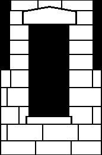
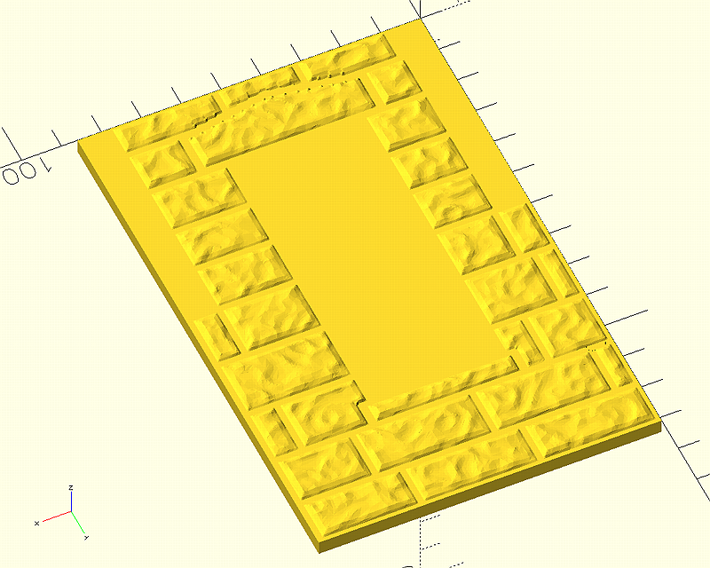

# stonewall
Command line program to make stones for a wall

## Introduction

In the quest to develop stone walls for a scale modeling project, I originally developed a couple of programs (contours, noisetool, repos in this account) to do various parts, tied together with a bash script.  Translating that to a Windows CMD .bat file proved challenging, and I wanted to make this process as easy as possible for non-computer-oriented scale modelers to use.  Long story short, I ended up with stonewall, a franken-program that gloms together three major libraries and contributed code from others.  The result actually eats into functions done in OpenSCAD, my CAD of choice, primarily to control the degree of complexity of stone textures to mitigate the CAD computation burden.

stonewall takes as input a .png image that depicts the wall layout of stones, black background, white stones, and produces either a set of stones or a consolidated wall (.3mf or .stl files) for further CAD incorporation into a modeling project.  Also input is a texture definition file used by libnoise to produce a network of operators from which the stone tecture is developed.  A large number of command line parameters are provided to control the generation process.

## Example

stonewall uses images like this:



to make .stl or .3mf wall files that looks like this:



The wall file can then be imported to most any CAD program for cutting out the window openings, etc.


## Usage

```
$ stonewall <inputimagefile> [param=value [param=value]... ]
```
Where param can be any of the following, in any order to the right of the input image file:

- resize: if defined, resizes the input image using WxH, e.g., 'resize:640x480'.  If either width or height is not specified, the resize of that dimension is calculated with the proportion of the defined dimension to the original image dimension, e.g., 'resize:640', or 'resize:x480'
- epsilon: The value used to specify the degree of simplification of contours, larger is simpler.  Set to 0.0 to disable.  Default: 0.0
- border: if defined, draws a white border around the image, useful for isolating contours that butt up against the image edge.  Default width: 1
- minarea: minimum area of a valid contour.  Default: 0
- minpoints: culls polygons with number of points less than this number.  Default: 4
- boundingbox: if defined, the polygons are four-point polygons describing the contours' bounding boxes
- noisefile: the noise network to pass to noisetool to get the texture
- baseheight: thickness of the base munged to the bottom of the texture
- bevelevels: number of increments to bevel stone edges.  Default=1
- simplify: consolidates planar triangles to simplify the stone mesh.  Default=0.0
- scale: changes the size of the completed stone/wall by the given multiplier"
- walldepth: thickness of the backing added to the stone assembly if 'output=wall' is specified.  Default: 1.0
- <s>fileextension: mesh file type to save stones/walls.  Default: 3mf</s> stonewall now only supports 3MF files
- output: What the program generates.  Four options: 
  - testimage: makes a copy of the input image with the contours drawn in red and labeled with their sequence numbers
  - openscadarrays: writes a file named imagefilebasename.scad, containing OpenSCAD arrays for contour width/heights, centers, translation, and a set of [0,0,0] arrays for user-specified translation (usually different heights to make individual stones 'stand proud')
  - wall: adds a backing cube to the stone collection to make a single wall file.
  - stones: outputs each stone as a separate mesh file, named with the sequence number of the stone, e.g., '0.3mf'
  - stonefile: outputs each stone as a separate mesh in a single file.  Only works with .3mf files.


The generated OpenSCAD code is a collection of arrays-of-arrays:

- pc: x,y center points of each contour.
- pw: w,h width/height coordinates of each contour.
- pt: translate coordinates for each polygon.  Note, the polygon coordinates in p are already translated, this array is for moving textures to align wtih contours.
- pr: a set of 0,0,0 coordinates for post-generation user translations, e.g., if you want a particular stone to cantilever out of the wall, set its pr z to some positive number and use it in translate().

## Building

stonewall is not an easy code to build.Two libaries, libnoise and Manifold, are not available in the distro package repositories.  For the win32 build in particular, I had to hand-mung things like file locations and symbolic links to get everything to play together.  If one has system-installed OpenCV, Manifold, or libnoise libraries the CMake code should find it; if not, open an issue here.

libnoise, OpenCV, and Manifold have BUILD_ logic available to use downloaded or gihub-cloned builds to static libraries.  To use any, include -DBUILD_<LIBRARY>=GITHUB|SRCPKG|path-to-tar-gz for the library in the cmake invocation.  Available logic are BUILD_OPENCV, BUILD_LIBNOISE, and BUILD_MANIFOLD.

For example, if one wants to build a copy of OpenCV specifically for stonewall:

```
$ mkdir build && cd build
$ cmake -DBUILD_OPENCV=SRCPKG ..
```

The options are:
- GITHUB: The OpenCV library is git-cloned from its GitHub repository and built.
- SRCPKG: The OpenCV library .tar.gz is downloaded, unpacked, and built.
- .tar.gz-file: This is a path to an already-downloaded OpenCV .tar.gz source code release file

## Dependencies/Contributed Code

stonewall uses the following libraries under the terms of the respective licenses:

- libnoise, coherent noise generator: https://github.com/eXpl0it3r/libnoise, LGPL 2.1
- 
- OpenCV, image processing: https://github.com/opencv/opencv, Apache 2.0
- Manifold, B-rep mesh processing: https://github.com/elalish/manifold, Apache 2.0
- miniz, zip compression: https://github.com/richgel999/miniz, MIT

stonewall uses code extracted from the following libraries:

- noisetool, command line encapsulation of libnoise: https://github.com/butcherg/noisetool, GPL 3.0
  - Extracted the noise processor for incorporation into stonewall, so one doesn't have to download noistool separately
- hmm, heightmap meshing: https://github.com/fogleman/hmm, MIT:
  - SaveBinarySTL(): https://github.com/fogleman/hmm/blob/master/src/stl.cpp, edited to remove glm dependency
  - various hints to implement an OpenSCAD-equivalent heightmap mesh
- Binary_STL_to_3MF, 3mf export routine: https://github.com/sjhalayka/Binary_STL_to_3MF, no license
  - Used write_3fm_to_oss_buffer() organization to write an abbreviated 3MF file export routine

## License
MIT
